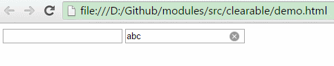
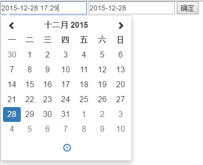
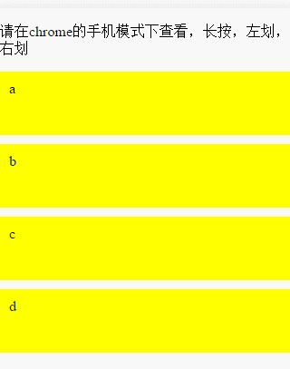
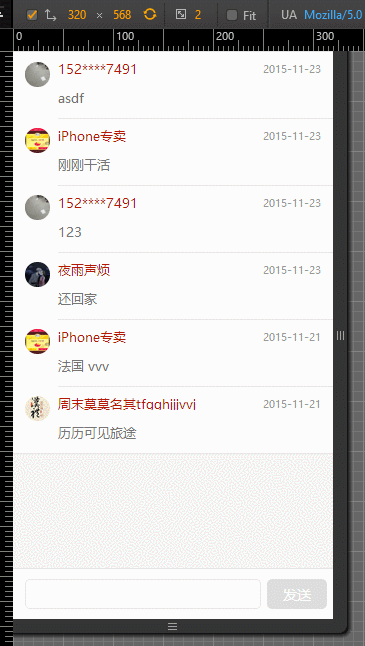
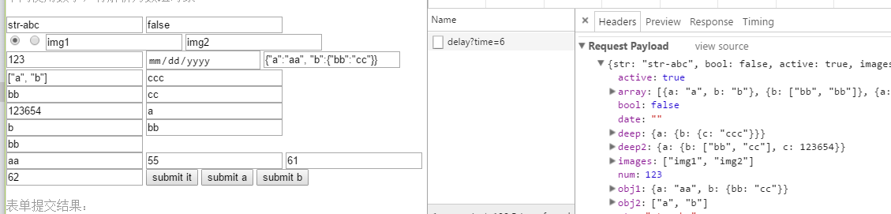
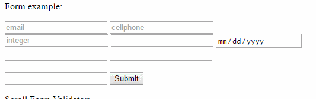
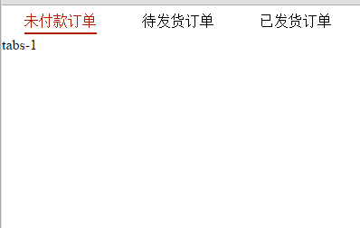
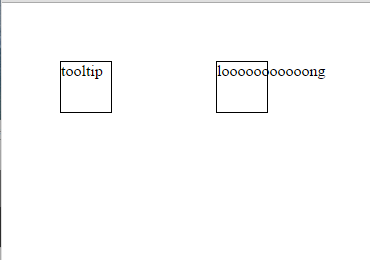
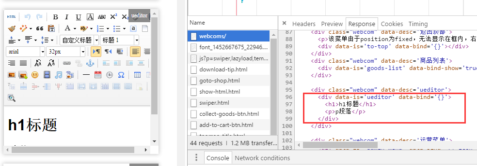

# DEMO

### alert

### citySelect

### confirm

### clearable

### confirm

### CSS-Controls
* checkbox   
* like-weibo   
* radio    
* switch-ios   

### datetime (based on [rome](https://github.com/bevacqua/rome))
* 

### deletable
* 

### editor -> ueditor for nodejs

* Step 1: `npm install`
* Step 2: `node app.js`   
* ueditor-local for local test.
* ueditor-proxy for online project.

### events
* 

### formJSON
* 

### formValidator
* 

### imageView
* 

### lazyload
* 

### loadpage
* Load page   
* You can also see [This project](https://github.com/zhoukekestar/mobilebone).

### paging
* 

### prompt

### pull
* 

### pull-v2
* 

### tabs
* 

### toast
* 

### tooltip
* 

### upload
* Run command `node app.js`
* Open browser & visit `localhost:3000`
* Demo is in `public` directory
* Preview   

### webcom
* 借鉴[react](https://github.com/facebook/react-native)和[polymer](https://github.com/Polymer/polymer)的组件化思路，但不依赖于他们的tiny framework
* 这是一个组件项目[//common.toomao.com](http://common.toomao.com/webcoms/)
* 这是一个应用项目[//m.toomao.com/square](https://m.toomao.com/square)
* 只需通过data-is指定使用哪个组件，组件将自动初始化，所有的组件依赖资源都由组件内部加载
* 

### jquery2navtive.html
* jQuery to navtive list.
* TODO: remove jquery denpency on modules.

### Modules' convention
* Module SHOULD auto init after triggering window's `load` event.
* Module SHOULD re-init after triggering window's `reload` event.
