### _Fix( _fixDesktop & _fixMobile & _fixCSS)
* Fix browser's compatibility.
* Code your js as no IE exist. Code once by W3C api, run everywhere (include IE).
* You can also see [This project(ieBetter.js)](https://github.com/zhoukekestar/ieBetter.js).

### _lib
Base libraries for modules like: jQuery.

### alert
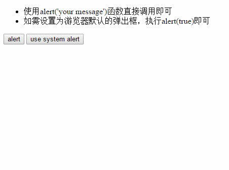

### alertMsg
Alert message. 
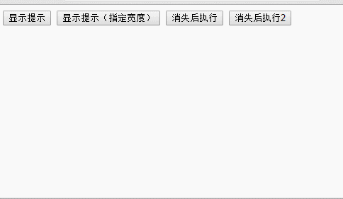

### citySelect
Select city for China. 
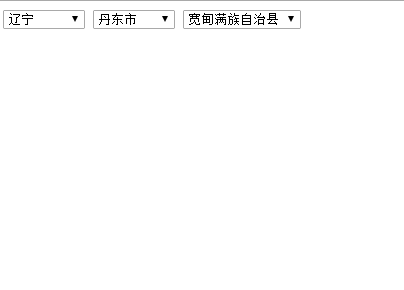

### confirm

### CSS-Controls
* checkbox   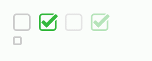
* like-weibo   
* radio    
* switch-ios   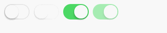

### loadpage
* Load page   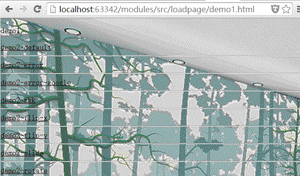
* You can also see [This project](https://github.com/zhoukekestar/mobilebone).

### paging
* 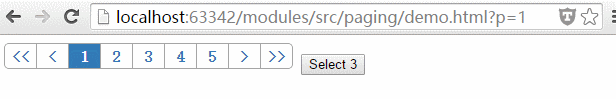

### prompt
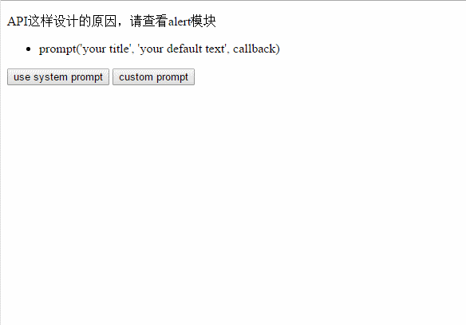

### pull
* Pull to refresh.   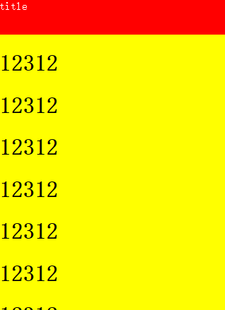

### pull-v2
* Pull to refresh `version 2`.   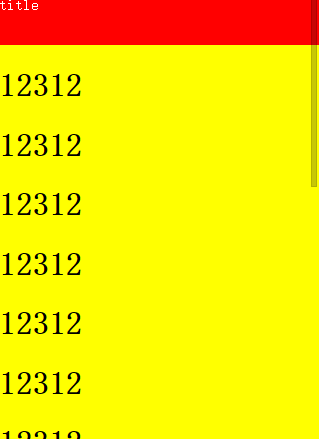

### editor -> ueditor for nodejs

* Step 1: `npm install`
* Step 2: `node app.js`   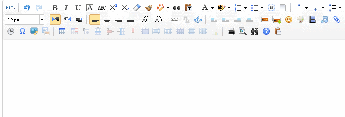
* ueditor-local for local test.
* ueditor-proxy for online project.

### upload
* Run command `node app.js`
* Open browser & visit `localhost:3000`
* Demo is in `public` directory
* Preview   

### jquery2navtive.html
* jQuery to navtive list.
* TODO: remove jquery denpency on modules.

### Modules' convention
* Module SHOULD auto init after triggering window's `load` event.
* Module SHOULD re-init after triggering window's `reload` event.

